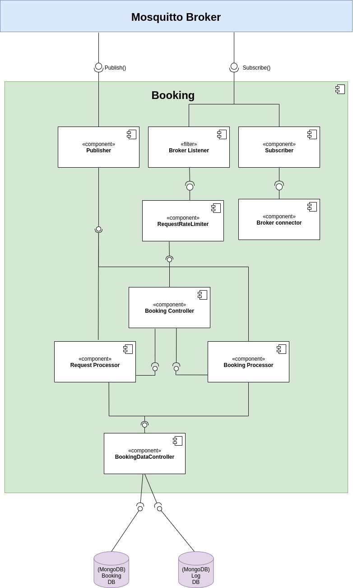

# booking

## Link to main documentation repository
- [Documentation repositoy](https://git.chalmers.se/courses/dit355/2020/group-2/documentation)

## Project setup

### Prerequisites

- Install the dependency packages from npm
``` 
npm install
```

### Run the service
```
cd src
node index.js
```

## Diagrams

### Low-level booking component diagram


